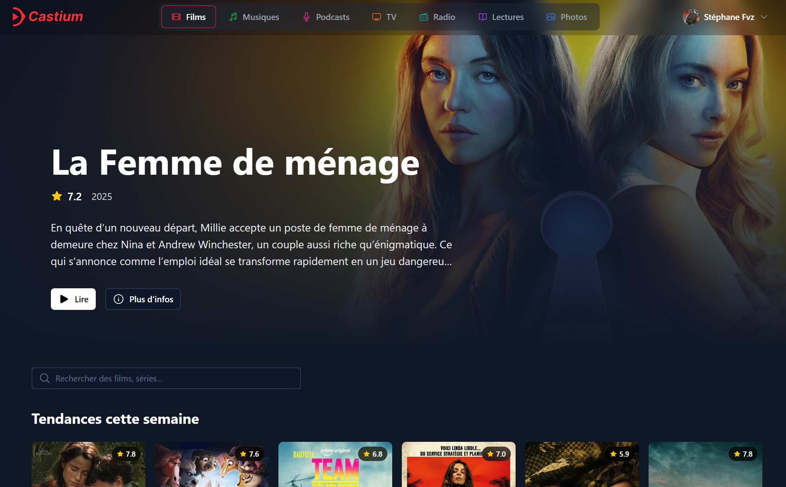
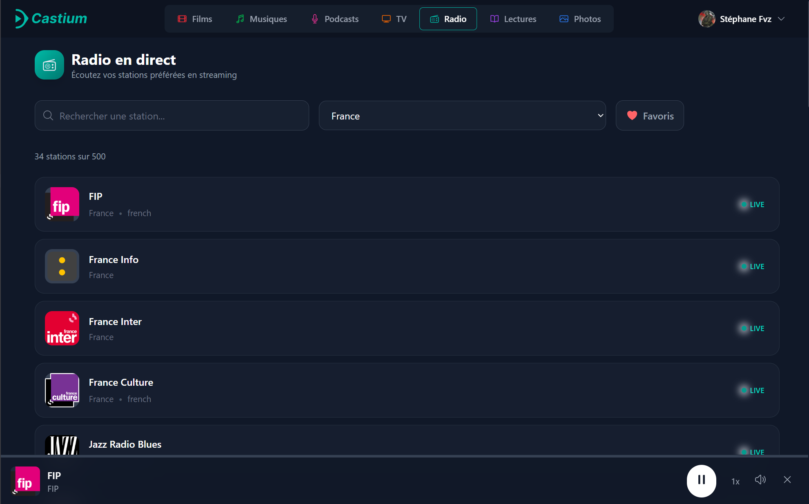
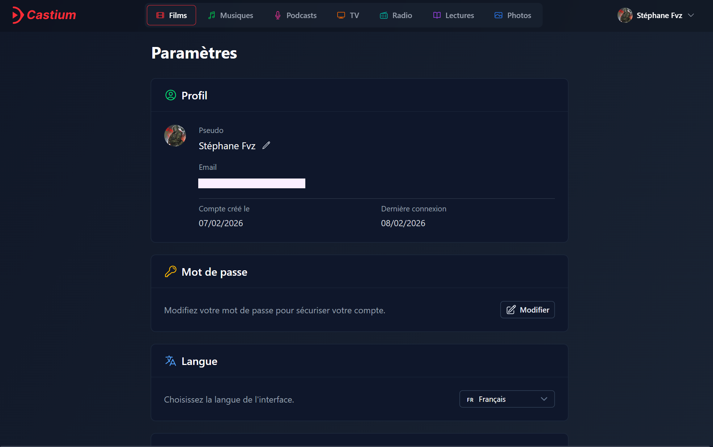

# Castium

[](LICENSE)
[](https://nuxt.com/)
[](https://supabase.com/)
[](https://vuejs.org/)

Castium est une plateforme multimédia personnelle qui centralise films, musiques, podcasts, radio, TV, photos et vidéos dans une interface web unique.

## Aperçu

- Frontend Nuxt 4 + Vue 3 + Tailwind.
- Authentification et stockage avec Supabase.
- Intégrations Spotify, YouTube et TMDB.
- Interface multilingue (`fr`, `en`, `pl`).
- Gestion des thèmes/couleurs par catégorie.

## Détail Frontend

Castium est construit comme une SPA Nuxt (`ssr: false`) orientée composants/composables:

- `castium/app/pages/`:
  pages fonctionnelles par domaine (`movies`, `music`, `podcasts`, `radio`, `tv`, `lectures`, `photos`, `settings`).
- `castium/app/components/`:
  UI réutilisable (navigation, cartes, lecteur global, sections landing).
- `castium/app/composables/`:
  logique métier isolée par feature (`useTMDB`, `useSpotify`, `useYouTube`, `useLocalMusic`, `useCloudPhotos`, etc.).
- `castium/app/layouts/default.vue`:
  layout principal avec shell d'application.
- `castium/app/middleware/auth.global.ts`:
  protection des routes authentifiées.
- `castium/i18n/locales/*.json`:
  internationalisation complète (FR/EN/PL, stratégie sans préfixe d'URL).

Sur la partie UX/front:

- Théming par catégorie via `useTheme`.
- Player global partagé entre pages (`useGlobalPlayer` + `GlobalPlayer.vue`).
- Intégration Nuxt UI + Tailwind pour un rendu cohérent et responsive.
- Persistance locale ciblée (tokens OAuth, préférences, progression vidéo) via `localStorage`.

## Fonctionnalités principales

- Films et séries avec métadonnées (TMDB).
- Musique locale/cloud + connexion Spotify.
- Podcasts, radio et TV (incluant flux personnalisés M3U8).
- Lectures/vidéos avec intégration YouTube.
- Photos locales/cloud.
- Gestion du profil, mot de passe, suppression de données et compte.

## Structure du repo

```text
.
├─ castium/                 # Application Nuxt
├─ supabase/                # Migrations SQL + fonctions backend
└─ documentation/
   ├─ screenshots/          # Captures d'écran pour le README
   └─ tests/
```

## Démarrage rapide

```bash
git clone <url-du-repo>
cd Castium/castium
pnpm install
cp .env.example .env
pnpm dev
```

Application dispo sur `http://localhost:3000`.

## Variables d'environnement

Variables importantes (selon les fonctionnalités activées):

```bash
# Supabase
SUPABASE_URL=
SUPABASE_ANON_KEY=
SUPABASE_SERVICE_ROLE_KEY=
NUXT_PUBLIC_SUPABASE_URL=
NUXT_PUBLIC_SUPABASE_ANON_KEY=

# TMDB
NUXT_PUBLIC_TMDB_API_KEY=

# Spotify
SPOTIFY_CLIENT_SECRET=
NUXT_PUBLIC_SPOTIFY_CLIENT_ID=
NUXT_PUBLIC_SPOTIFY_REDIRECT_URI=http://localhost:3000/auth/spotify/callback

# YouTube
YOUTUBE_CLIENT_SECRET=
NUXT_PUBLIC_YOUTUBE_CLIENT_ID=
NUXT_PUBLIC_YOUTUBE_REDIRECT_URI=http://localhost:3000/auth/youtube/callback
```

## Scripts utiles

Depuis le dossier `castium/`:

```bash
pnpm dev              # Développement
pnpm dev:https        # Développement HTTPS (certificats locaux)
pnpm build            # Build production
pnpm preview          # Preview production
pnpm lint             # Lint
pnpm test             # Tous les tests
```


```md




```

## Licence

Ce projet est sous licence MIT. Voir [`LICENSE`](LICENSE).
