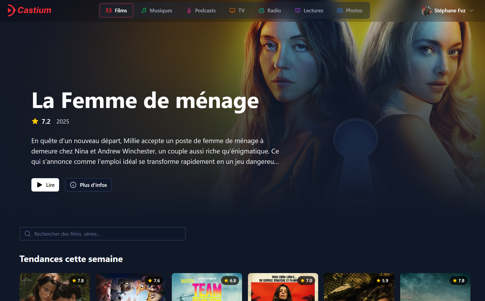
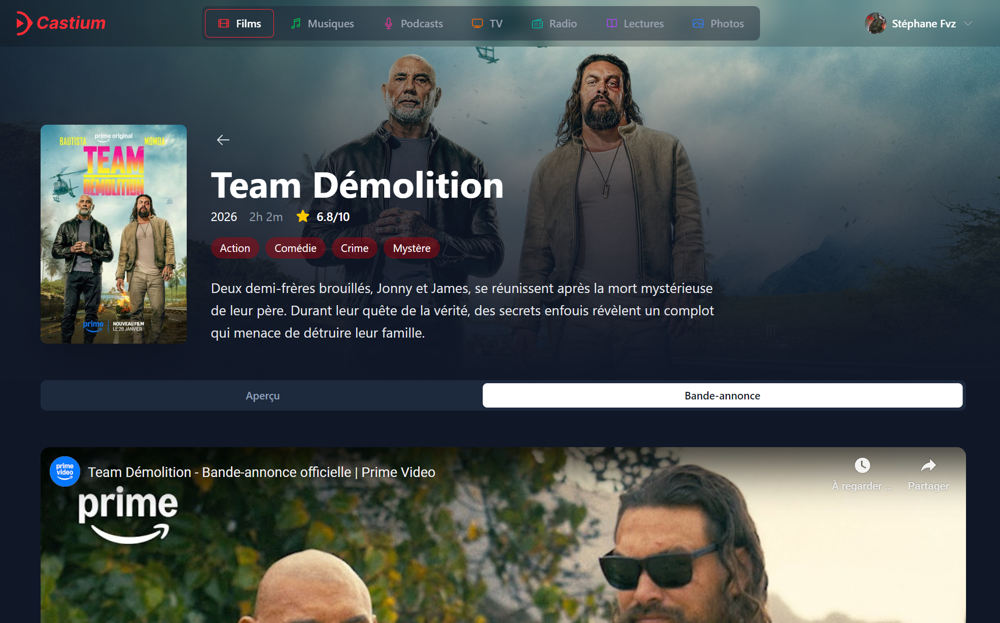
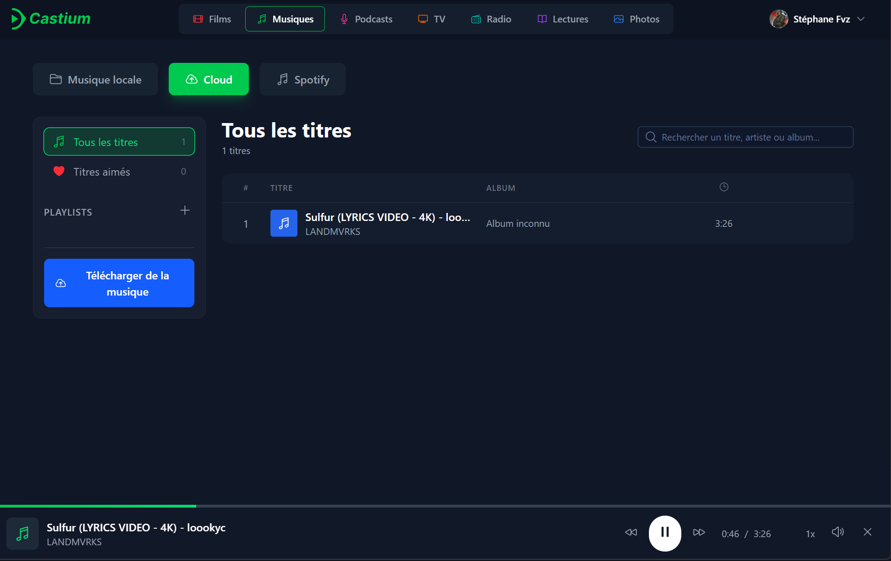
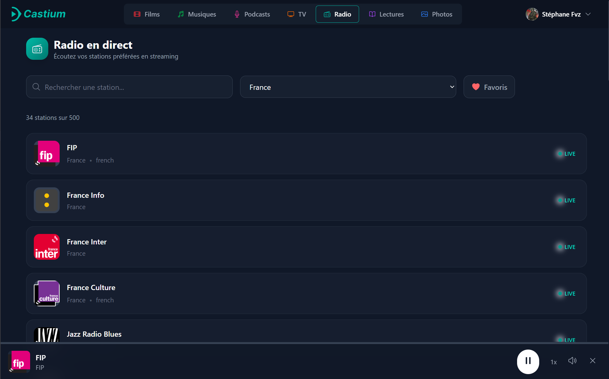
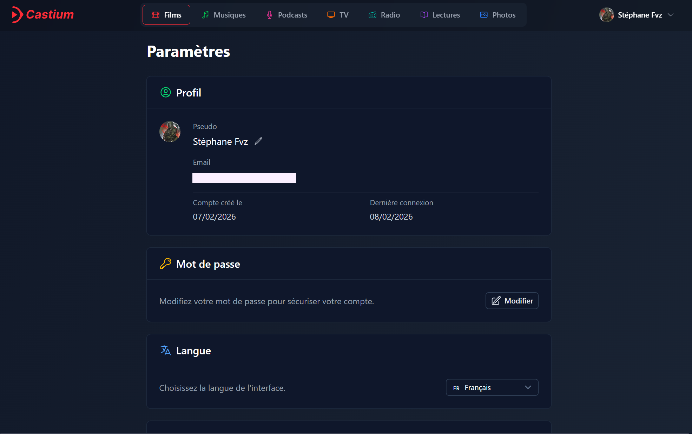

<p align="center"style="padding: 28px 0;">
  
</p>


<p align="center">
  <a href="LICENSE">
    
  </a>
  <a href="https://nuxt.com/">
    
  </a>
  <a href="https://supabase.com/">
    
  </a>
  <a href="https://vuejs.org/">
    
  </a>
</p>

<p align="center" style="padding: 12px 0;">
  <span style="font-size: 1.15em; font-weight: 600; color: white;">
    Castium is a personal multimedia platform that centralizes movies, music, podcasts, radio, TV, photos and videos in a single web interface.
  </span>
</p>

<p align="center">
  
</p>

<table align="center">
  <tr>
    <td>
      
    </td>
    <td>
      
    </td>
  </tr>
  <tr>
    <td>
      
    </td>
    <td>
      
    </td>
  </tr>
</table>

## Overview

- Frontend: Nuxt 4 + Vue 3 + Tailwind.
- Authentication and storage with Supabase.
- Spotify, YouTube and TMDB integrations.
- Multilingual interface (`fr`, `en`, `pl`).
- Theme/color management per category.

## Frontend Details

Castium is built as a Nuxt SPA (`ssr: false`) focused on components/composables:

- `castium/app/pages/`:
  functional pages per domain (`movies`, `music`, `podcasts`, `radio`, `tv`, `lectures`, `photos`, `settings`).
- `castium/app/components/`:
  reusable UI (navigation, cards, global player, landing sections).
- `castium/app/composables/`:
  business logic isolated by feature (`useTMDB`, `useSpotify`, `useYouTube`, `useLocalMusic`, `useCloudPhotos`, etc.).
- `castium/app/layouts/default.vue`:
  main layout with application shell.
- `castium/app/middleware/auth.global.ts`:
  authenticated route protection.
- `castium/i18n/locales/*.json`:
  full internationalization (FR/EN/PL, prefix-free URL strategy).

On the UX/frontend side:

- Per-category theming via `useTheme`.
- Global player shared across pages (`useGlobalPlayer` + `GlobalPlayer.vue`).
- Nuxt UI + Tailwind integration for consistent and responsive rendering.
- Targeted local persistence (OAuth tokens, preferences, video progress) via `localStorage`.

## Main Features

- Movies and TV shows with metadata (TMDB).
- Local/cloud music + Spotify connection.
- Podcasts, radio and TV (including custom M3U8 streams).
- Lectures/videos with YouTube integration.
- Local/cloud photos.
- Profile management, password, data deletion and account.

## Repository Structure

```text
.
├─ castium/                 # Nuxt application
├─ supabase/                # SQL migrations + backend functions
└─ documentation/
   ├─ screenshots/          # Screenshots for the README
   └─ tests/
```

## Quick Start

```bash
git clone <repo-url>

cd Castium/castium

pnpm install

cp .env.example .env

pnpm dev
```

Application available at `http://localhost:3000`.

## Environment Variables

Key variables (depending on the features enabled):

```bash
# Supabase
SUPABASE_URL=
SUPABASE_ANON_KEY=
SUPABASE_SERVICE_ROLE_KEY=
NUXT_PUBLIC_SUPABASE_URL=
NUXT_PUBLIC_SUPABASE_ANON_KEY=

# TMDB
NUXT_PUBLIC_TMDB_API_KEY=

# Spotify
SPOTIFY_CLIENT_SECRET=
NUXT_PUBLIC_SPOTIFY_CLIENT_ID=
NUXT_PUBLIC_SPOTIFY_REDIRECT_URI=http://localhost:3000/auth/spotify/callback

# YouTube
YOUTUBE_CLIENT_SECRET=
NUXT_PUBLIC_YOUTUBE_CLIENT_ID=
NUXT_PUBLIC_YOUTUBE_REDIRECT_URI=http://localhost:3000/auth/youtube/callback
```

## Useful Scripts

From the `castium/` folder:

```bash
pnpm dev              # Development
pnpm dev:https        # HTTPS development (local certificates)
pnpm build            # Production build
pnpm preview          # Production preview
pnpm lint             # Lint
pnpm test             # All tests
```

## License

This project is licensed under the MIT License. See [`LICENSE`](LICENSE).
